# Architecture

## System architecture overview

UMAT is implemented as a monolithic full-stack application with a static frontend served by a Spring Boot backend.

The architecture consists of three main layers:

1. **Frontend layer**
   - Static HTML/CSS/JavaScript pages
   - Client-side authentication flow using JWT stored in `localStorage`
   - API requests are routed to `/api/*`

2. **Backend layer**
   - Spring Boot application with REST controllers
   - Spring Security for stateless JWT authorization
   - JPA repositories and entity models for persistence
   - Razorpay integration for payment order creation

3. **Deployment layer**
   - Docker image built using a multi-stage Dockerfile
   - `docker-compose.yml` defines the application and optional Traefik service
   - GitHub Actions workflow deploys to a remote host over SSH

## Component diagram

```mermaid
flowchart LR
    Browser[Browser / Static Frontend]
    Browser -->|GET /index.html| Backend[Spring Boot Backend]
    Browser -->|API: POST /api/auth/login| AuthController
    Browser -->|API: GET /api/products| ProductController
    Browser -->|API: POST /api/cart/add| CartController
    Browser -->|API: POST /api/orders/create| OrderController
    Browser -->|API: POST /api/payment/create-order| PaymentController
    AuthController --> JwtUtil
    CartController --> UserRepository
    CartController --> ProductRepository
    OrderController --> OrderRepository
    PaymentController --> Razorpay
```

## Folder structure

- `spring_backend/`
  - `src/main/java/com/umat/backend/controller/` — API controllers
  - `src/main/java/com/umat/backend/security/` — JWT and security configuration
  - `src/main/java/com/umat/backend/model/` — JPA entities
  - `src/main/java/com/umat/backend/repository/` — Spring Data repositories
  - `src/main/resources/application.properties` — environment-driven configuration

- Root frontend assets
  - `*.html` — page templates and static markup
  - `style.css` — shared stylesheet
  - `auth.js` — authentication helper
  - `config.js` — runtime configuration for API endpoints

- Deployment and automation
  - `Dockerfile` — multi-stage build
  - `docker-compose.yml` — container orchestration definition
  - `.github/workflows/deploy.yml` — CI/CD deployment workflow

## Data flow

- User signs up or logs in through `/api/auth/signup` or `/api/auth/login`
- Backend returns JWT token
- Frontend stores token in `localStorage` and sends it in `Authorization: Bearer` headers
- Backend validates token in `JwtFilter` and attaches user context to requests
- Protected endpoints require authentication for cart, order, and payment operations

## Security boundaries

- Authentication is stateless using JWT
- Passwords are stored hashed using BCrypt
- Sensitive values are externalized to environment variables
- Health endpoint is exposed for monitoring at `/actuator/health`
